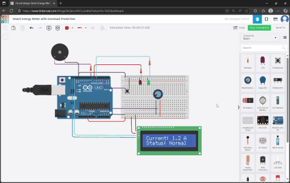

# ⚡ Smart Energy Meter with Overload Protection System

A real-world industrial safety system built using Arduino Uno that simulates current monitoring and protection using LED indicators, buzzer, LCD alerts, and manual reset logic. Ideal for **industrial panels, smart energy devices, and motor protection units** used in companies like **Bosch**, **L&T**, and **Tata Power**.

---

## 🎬 Project Demo

> ✅ Demonstrates normal condition, overload detection, buzzer/LED alerts, and manual reset mechanism.

---

## 🖼️ Circuit Diagram

[cricuit.dig](/Cricuit.png)

---

## 🎯 Project Goal

In modern industries, motors and machines can fail due to **overload or excess current**. This system:

- Simulates **current sensing** using potentiometer  
- Detects overload condition above threshold (e.g., 10A)  
- Triggers **buzzer, red LED, fan OFF**, and LCD alert  
- Allows manual reset once system cools down  
- **Prevents damage, ensures safety, and alerts the operator**

---

## 🔧 Features

| Feature                        | Description |
|-------------------------------|-------------|
| 🟢 Green LED                   | Indicates **Normal condition** (Safe current) |
| 🔴 Red LED + Buzzer            | Activated during **Overload condition** |
| 💨 Fan (DC Motor)              | Stops during overload for protection |
| 🖲️ Push Button                | Used for **manual reset** after cooldown |
| 📺 16x2 LCD Display            | Shows system status: Current, Overload, Reset |
| 🎚️ Potentiometer              | Simulates current sensor (0A – 20A using `map()`) |

---

## 📦 Bill of Materials (BOM)

| Component             | Quantity |
|----------------------|----------|
| Arduino UNO          | 1        |
| 16x2 LCD             | 1        |
| Potentiometer (10k)  | 1        |
| Buzzer               | 1        |
| DC Motor (as Fan)    | 1        |
| Red, Green LEDs      | 2        |
| Push Button          | 1        |
| Resistors (220Ω, 10k)| As needed |
| Breadboard + Jumper Wires | As needed |

📎 BOM file: [`bom.csv`](bom.csv)

---

## 💡 How It Works

1. **Potentiometer** simulates current from 0A to 20A.
2. If current < 10A:
   - Green LED ON  
   - Fan ON  
   - LCD shows: `System Normal`
3. If current ≥ 10A:
   - Red LED and **Buzzer ON**  
   - Fan OFF  
   - LCD shows: `Overload! Reset Required`
4. After a 30-second cooldown, **press button** to reset system.

---

## 📂 Files Included

| File | Description |
|------|-------------|
| [`smart_energy_meter_with_overload_protection1.ino`](smart_energy_meter_with_overload_protection1.ino) | Arduino code |
| [`circuit.dig`](circuit.dig) | Circuit Diagram |
| [`bom.csv`](bom.csv) | Bill of Materials |
| [`Smart Energy Meter with Overload Protection.pdf`](Smart%20Energy%20Meter%20with%20Overload%20Protection.pdf) | Project Report |
| [`smart_energy_meter_demo.gif`](smart_energy_meter_demo.gif) | Demo GIF |

---

## 🏭 Industrial Applications

This embedded system mimics the logic found in:

✅ **Overload relays** in industrial motors  
✅ **Current cut-off systems** in HVAC and automation panels  
✅ **Smart energy meters** for protection in electrical distribution  
✅ **IOT-powered motor protection** in modern factories  
✅ **Power saver kits** with LCD status for monitoring

> 🎯 Ideal for use in factories, workshops, R&D labs, smart grid systems, and educational simulations.

---

## 🛠️ Tools & Technologies

- Arduino Uno  
- Embedded C (Arduino IDE)  
- Tinkercad Circuits  
- Potentiometer for analog simulation  
- LCD with I2C or direct pins  
- Real-time alert system

---

## 👨‍💻 Author

**Parth Pawar**  
🔗 [GitHub](https://github.com/parth-558)  
🔗 [LinkedIn](https://www.linkedin.com/in/parth-pawar-b82628248/)

---

## 🏷️ Tags

> embedded-system, smart-energy-meter, arduino, industrial-safety, overload-protection, lcd, tinkercad, buzzer, potentiometer

---

